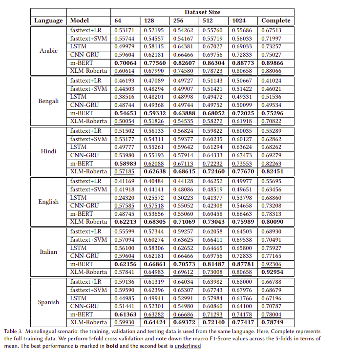

# Exploring Deep Learning Models for the Detection of Online Misogyny
 
This is my Project under [Professor Animesh Mukherjee](https://cse.iitkgp.ac.in/~animeshm/) with PhD Mithun Das where we have explored various Deep Learning Models for the detection of Online Mysogyny. We have experimented with various datasets and will be presenting the results in a Paper. 

### Dataset Details

Here are a few samples of Hate and Non Hate samples from the English, Italian and Hindi Datasets. 

### Models Trained
1. FastText Embeddings with Logistic Regression
2. FastText Embeddings with SVM
3. LSTM
4. CNN GRU
5. m-BERT
6. XLM Roberta

### Language | Dataset
1. English | Shared Task English
2. Hindi | Shared Task Hindi
3. Bengali | Shared Task Bengali
4. Arabic | Let-Mi
5. Spanish | AMI-Spanish
6. Italian | AMI-2020

### Experimentation and Results

We have done a thorough analysis of the performance of the deep learning models on the above languages by trying out various settings which I have explained below. 

First we trained the models by **incrementally feeding more data** starting from 32 data points from each of the Hate and Non Hate categories and then moving on to 64, 128, 256 and 512 samples and finally the complete datasets. We perform **5-fold cross validation** and note down the **macro F1-Score** values across the 5-folds in terms of mean. 

We also tested the **zero shot performance** of models trained on one dataset on every other dataset. 

We also trained the models on **all-but-one** language and tested the **few shot performance** on the remaining language using the same 5-fold cross validation method.

English being a language that has the most training data, we ran experiments on our Data **Translated** into English too. We tested the **zero shot performance** of models trained on our English Datasets and performance on Monolingual Models like **BERT-base** and **RoBERTa-base**.

### Code Structure

- [Data Processed Folder](./Data_Processed/): This folder contains the various datasets processed so that be used easily in the code.
- [Notebooks](./Notebooks/): This folder contains various jupyter notebooks that has the code with explainations
    - [Classical_Models.ipynb](./Notebooks/Classical_Models.ipynb): Notebook where code of classical models has been covered.
    - [CNN_GRU.ipynb](./Notebooks/CNN_GRU.ipynb): Notebook where code of training CNN GRU has been explained
    - [Codemixed_Fast-text_Embeddings.ipynb](./Notebooks/Codemixed_Fast-text_Embeddings.ipynb): Code to generate Fasttext embeddings for Code-Mixed Hindi and Bengali data
    - [Data_Processing.ipynb](./Notebooks/Data_Processing.ipynb): Code used to process the original datasets to make it ready for use in models
    - [LSTM.iypnb](./Notebooks/LSTM.ipynb): Code for training LSTM Model.
    - [m-BERT.ipynb](./Notebooks/m-BERT.ipynb): Code for training m-BERT Model
    - [Multilingual_Model_Save.iypnb](./Notebooks/Multilingual_Model_Save.iypnb): Code used to save the models trained on all but one languages
    - [One_shot_and_few_shot_learning_All_But_One_BERT.ipynb](./Notebooks/One_shot_and_few_shot_learning_All_But_One_BERT.ipynb): Code to perform one shot and few shot learning on m-BERT model trained on one language on another.  
    - [One_shot_and_few_shot_learning_All_But_One_Roberta.ipynb](./Notebooks/One_shot_and_few_shot_learning_All_But_One_Roberta.ipynb): Code to perform one shot and few shot learning on XLM Roberta model trained on one language on another.
    - [One_shot_and_few_shot_learning_All_But_One.ipynb](./Notebooks/One_shot_and_few_shot_learning_All_But_One.ipynb): Code to perform one shot and few shot learning.
    - [Output_Analysis_LIME.ipynb](./Notebooks/Output_Analysis_LIME.ipynb): Code to explain the output of the models using LIME Explainer
    - [Translated.ipynb](./Notebooks/Translated.ipynb): Code to run models on the translated datasets.
    - [XLM_Roberta.ipynb](./Notebooks/XLM_Roberta.ipynb): Code to train XLM Roberta Model. 
    - [Zero_Shot_Matrix.ipynb](./Notebooks/Zero_Shot_Matrix.ipynb): Code to get zero shot output of models trained on one language on another for every pair of languages. 
- [bert_arabic.py](bert_arabic.py): Code for training the arabert (Arabic BERT) model.
- [bert.py](bert.py): Code for the BERT Class used for training m-BERT model
- [classic_models.py](classic_models.py): Code for training various classical models 
- [CNN_GRU.py](CNN_GRU.py): Code for training CNN GRU Model.
- [data_cleaning.py](data_cleaning.py): Code for preprocessing the text in the dataset
- [fewShot.py](fewShot.py): Code for BERT Model for Few Shot training
- [LSTM.py](LSTM.py): Code for training LSTM Model
- [models.py](models.py): Code for the model structure of CNN GRU, LSTM and weighted Roberta model
- [testing_all.py](testing_all.py): Code for running the tests on complete datasets for various deep learning models
- [testing_classic.py](testing_classic.py): Code for running the tests on complete datasets for various classical machine learning models
- [xlm_roberta.py](xlm_roberta.py): Code for training the weighted XLM Roberta model.
